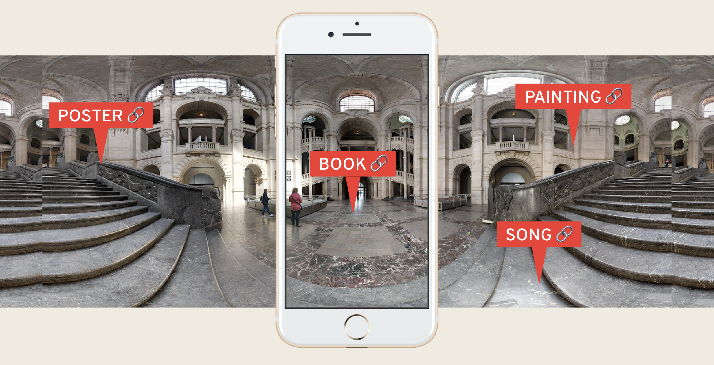

# React.js User Search
 
## [Description](#description) &nbsp;&bull;&nbsp; [Screenshot](#screenshot) &nbsp;&bull;&nbsp; [Installation](#installation) &nbsp;&bull;&nbsp; [License](#license) &nbsp;&bull;&nbsp; [Demo](#demo) &nbsp;&bull;&nbsp; [GitHub](#gitHub) &nbsp;&bull;&nbsp; [Landmarks](#landmarks) &nbsp;&bull;&nbsp; [APIs](#apis) &nbsp;&bull;&nbsp; [Requirements](#requirements)
  
## Description

Use this React.js project to view non-sensitive data about employees

Team:
Jon Butler
https://github.com/JBdunks

Ha Nguyen
https://github.com/iamha1

Connor Fech
https://github.com/cfech

Walt Ribeiro
https://github.com/waltribeiro

## Screenshot

  

## Installation
* Download the repo
* Terminal command `npm run start`

## License

Photograph credits:
* picture 1: by [walt ribeiro](http://waltrib.com)
* picture 2: by [raeng](https://unsplash.com/photos/E-HKcFWMM34)
* picture 3: by [quino al](https://unsplash.com/photos/iRt9yOWzfOk)
* picture 4: by [william hook](https://unsplash.com/photos/9e9PD9blAto)

## Demo
https://waltribeiro.github.io/react-user-search

## GitHub
https://github.com/waltribeiro/react-user-search

## Story
I AM in search of an interactive way to share and discover projects with others during the quarantine

## Landmarks
indy hall = https://www.indyhall.org
national mechanics = https://www.nationalmechanics.com/
rec philly = https://www.recphilly.com/

Spherical Panoramas = little planet, equirectangular, gopro 360, panorama
https://www.ptgui.com/

https://livetourlab.com/tours/3004/#Patio

https://blog.agilevision.io/creating-simple-tourism-vr-application-using-react-360

## APIs
With WebVR and WebGL APIs we can already render 3D imagery within a web browser

Framework - Material UI
APIs 
JawsDB

## Requirements
* npm i creat-react-app node express mongod
* react.js
* node.js express web server
* mysql or mongodb database with a sequelize or mongoose orm
* GET routes
* POST routes
* deployed using Heroku
* 2 libraries, packages or technologies (APIs count here)
* user authentication
* polished UI
* MVC folder structure
* coding standards
* don't expose API keys